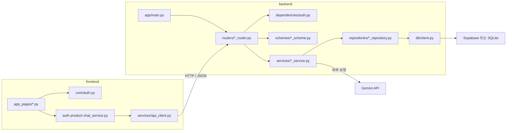

# 프론트엔드·백엔드 통합 개발 계획서

## 1. 문서 목적

현재 분리되어 있는 두 프로젝트를 하나의 서비스로 통합하기 전에 개발 범위, 구현 순서, API 계약, 테스트 기준을 합의하기 위한 계획서다.

- 프론트엔드: Streamlit 기반 사용자 화면
- 백엔드: FastAPI 기반 API 서버
- 최종 목표: 사용자가 로그인한 뒤 상품을 관리하고 Gemini 챗봇을 사용할 수 있는 통합 MVP 완성

> 이 문서의 일정은 1인 개발 기준의 예상치다. 실제 착수 전 인증 방식, 데이터베이스, 배포 환경을 확정한 뒤 조정한다.

## 2. 현재 프로젝트 분석

### 2.1 프론트엔드 현황

현재 구현된 기능:

- 멀티페이지 내비게이션
- 로그인 및 로그아웃 화면
- 회원가입 입력 화면
- 홈 대시보드 예시
- Open-Meteo API를 이용한 날씨 조회와 차트
- FastAPI 서버 상태 확인 화면
- 브라우저 세션 저장소를 이용한 로그인 상태 유지

현재 한계:

- 로그인 계정이 `id01` / `pwd01`로 코드에 고정되어 있음
- 회원가입 정보가 저장되지 않음
- 백엔드의 상품 및 채팅 API를 사용하는 화면이 없음
- 백엔드 주소가 소스에 고정되어 있음
- 로그인 여부만 브라우저에 저장되며 안전한 인증 토큰이 없음
- 홈 화면의 지표가 예시 데이터임

### 2.2 백엔드 현황

현재 구현된 기능:

- Gemini 단일 질문 API: `POST /chat/gemini`
- 상품 생성 API: `POST /product/create`
- 상품 단건 조회 API: `GET /product/get/{product_id}`
- 상품 전체 조회 API: `GET /product/getall`
- 상품 수정 API: `PUT /product/update/{product_id}`
- 상품 삭제 API: `DELETE /product/delete/{product_id}`
- 채팅 및 일부 상품 라우터 테스트
- `.env`를 통한 Gemini API 키와 모델 설정

현재 한계:

- 상품 데이터가 메모리나 데이터베이스에 저장되지 않고 고정 응답을 반환함
- 사용자 회원가입 및 로그인 API가 없음
- 프론트엔드가 요청하는 `GET /health` API가 없음
- 데이터가 없거나 ID가 잘못된 경우의 404 등 오류 처리가 부족함
- 상품 스키마의 필드 검증과 생성·수정 모델 분리가 충분하지 않음
- Gemini API 키 누락, 외부 API 장애 등에 대한 표준 오류 응답이 없음
- 삭제·수정 API 테스트와 서비스 단위 테스트가 부족함

## 3. 개발 목표 및 범위

### 3.1 MVP 필수 범위

1. 서버 상태 확인
2. 회원가입, 로그인, 로그아웃
3. 로그인 사용자 인증과 보호된 화면/API
4. 상품 등록, 목록, 상세, 수정, 삭제
5. Gemini 챗봇 단일 질문 및 응답
6. 프론트엔드와 백엔드의 공통 오류 처리
7. 주요 사용자 흐름의 자동 테스트
8. 환경 변수와 실행 방법 문서화

### 3.2 선택 범위

- 날씨 조회 기능 유지 및 UI 개선
- 채팅 내역 저장과 멀티턴 대화
- 상품 검색, 정렬, 페이지네이션
- 상품 이미지 업로드
- 관리자와 일반 사용자 권한 분리
- Docker 및 클라우드 배포

선택 범위는 MVP 완료 후 별도 우선순위로 진행한다.

### 3.3 제외 범위

첫 개발 주기에는 다음 항목을 제외한다.

- 결제 및 주문
- 소셜 로그인
- 실시간 채팅
- 대규모 트래픽 최적화
- 모바일 네이티브 앱

## 4. 목표 사용자 흐름

1. 사용자가 홈 화면에 접속한다.
2. 서버 연결 상태를 확인한다.
3. 신규 사용자는 회원가입 후 로그인한다.
4. 로그인 사용자는 상품 목록을 조회하고 상품을 등록·수정·삭제한다.
5. 로그인 사용자는 챗봇에 질문하고 Gemini 답변을 확인한다.
6. 로그아웃하면 인증이 필요한 화면과 API에 접근할 수 없다.

## 5. 목표 시스템 구성

```text
사용자
  ↓
Streamlit 프론트엔드
  ├─ 인증 화면
  ├─ 상품 관리 화면
  ├─ Gemini 채팅 화면
  └─ 날씨 조회 화면
  ↓ HTTP/JSON
FastAPI 백엔드
  ├─ Health API
  ├─ Auth API
  ├─ Product API
  └─ Chat API
  ↓
데이터베이스 + Gemini API
```

권장 구성:

- 화면: Streamlit
- API: FastAPI
- 요청 및 응답 검증: Pydantic
- 데이터베이스 및 인증: Supabase
- 외부 AI: Gemini
- 테스트: pytest, FastAPI TestClient
- 설정: `.env` 환경 변수

Supabase를 사용하지 않을 경우에는 SQLite와 JWT 인증을 대안으로 검토한다. 개발 착수 전에 한 가지 방식을 확정해야 한다.

### 5.1 권장 디렉터리 및 파일 구조

현재의 `frontend`와 `backend` 분리 구조는 유지한다. 화면, API 통신, 비즈니스 로직, 데이터 저장 로직이 한 파일에 섞이지 않도록 아래와 같이 확장한다.

표시 기준:

- `[기존]`: 현재 파일을 유지
- `[변경]`: 현재 파일의 역할을 보완하거나 내용을 수정
- `[신규]`: 개발 과정에서 새로 생성
- `[선택]`: MVP 이후 필요할 때 추가

```text
mini_frontend_02_mock/
├─ plan.md                              # [기존] 통합 개발 계획서
├─ README.md                            # [신규] 전체 설치·실행·테스트 안내
├─ .gitignore                           # [신규] 환경 변수와 생성 파일 제외
├─ .env.example                         # [신규] 공통 환경 변수 예시
│
├─ frontend/                            # Streamlit 사용자 화면
│  ├─ app.py                            # [변경] 앱 진입점과 메뉴 구성
│  ├─ requirements.txt                 # [변경] 프론트엔드 패키지 목록
│  ├─ README.md                         # [변경] 프론트엔드 단독 실행 안내
│  │
│  ├─ app_pages/                        # 페이지별 화면
│  │  ├─ 00_login.py                   # [변경] 백엔드 로그인 API 연결
│  │  ├─ 01_home.py                    # [변경] 서버·상품 실제 지표 표시
│  │  ├─ 02_signup.py                  # [변경] 백엔드 회원가입 API 연결
│  │  ├─ 03_weather.py                 # [기존] 외부 날씨 조회
│  │  ├─ 04_health.py                  # [변경] Health API 연결
│  │  ├─ 05_products.py                # [신규] 상품 목록·등록·수정·삭제
│  │  └─ 06_chat.py                    # [신규] Gemini 채팅 화면
│  │
│  ├─ core/                             # 앱 전역 설정과 인증 상태
│  │  ├─ __init__.py                   # [기존] Python 패키지 선언
│  │  ├─ config.py                     # [신규] API 주소·타임아웃 설정
│  │  └─ auth.py                       # [변경] 토큰·사용자 세션 관리
│  │
│  ├─ services/                         # 백엔드 API 호출 전담
│  │  ├─ __init__.py                   # [신규] Python 패키지 선언
│  │  ├─ api_client.py                 # [신규] 공통 HTTP 요청·오류 처리
│  │  ├─ auth_service.py               # [신규] 회원가입·로그인 요청
│  │  ├─ product_service.py            # [신규] 상품 API 요청
│  │  └─ chat_service.py               # [신규] Gemini 채팅 API 요청
│  │
│  └─ components/                       # 재사용 가능한 화면 요소
│     ├─ __init__.py                   # [신규] Python 패키지 선언
│     ├─ messages.py                   # [신규] 성공·오류 메시지 표시
│     └─ product_form.py               # [선택] 공통 상품 입력 폼
│
└─ backend/                             # FastAPI API 서버
   ├─ requirements.txt                 # [변경] 백엔드 패키지 목록
   ├─ README.md                         # [변경] 백엔드 단독 실행 안내
   ├─ .env.example                     # [신규] 백엔드 비밀 값 예시
   │
   ├─ app/
   │  ├─ __init__.py                   # [신규] Python 패키지 선언
   │  ├─ main.py                       # [변경] 앱 생성·라우터 등록
   │  │
   │  ├─ core/                         # 설정·보안·공통 기반
   │  │  ├─ __init__.py                # [신규] Python 패키지 선언
   │  │  ├─ config.py                  # [신규] 환경 변수 통합 관리
   │  │  ├─ security.py                # [신규] 비밀번호·토큰 처리
   │  │  └─ chat_config.py             # [변경] config.py로 통합 검토
   │  │
   │  ├─ dependencies/                 # 라우터 공통 의존성
   │  │  ├─ __init__.py                # [신규] Python 패키지 선언
   │  │  └─ auth.py                    # [신규] 현재 사용자 인증
   │  │
   │  ├─ routers/                      # URL과 요청·응답 연결
   │  │  ├─ __init__.py                # [신규] Python 패키지 선언
   │  │  ├─ health_router.py           # [신규] 서버 상태 API
   │  │  ├─ auth_router.py             # [신규] 회원가입·로그인 API
   │  │  ├─ product_router.py          # [변경] REST 상품 API
   │  │  └─ chat_router.py             # [변경] 인증된 채팅 API
   │  │
   │  ├─ schemes/                      # Pydantic 요청·응답 모델
   │  │  ├─ __init__.py                # [신규] Python 패키지 선언
   │  │  ├─ common_scheme.py           # [신규] 공통 오류 응답
   │  │  ├─ auth_scheme.py             # [신규] 인증 요청·응답
   │  │  ├─ product_scheme.py          # [변경] 생성·수정·조회 모델
   │  │  └─ chat_scheme.py             # [변경] 채팅 요청·응답 검증
   │  │
   │  ├─ services/                     # 업무 규칙
   │  │  ├─ __init__.py                # [신규] Python 패키지 선언
   │  │  ├─ auth_service.py            # [신규] 회원가입·로그인 처리
   │  │  ├─ product_service.py         # [변경] 상품 CRUD 처리
   │  │  └─ chat_service.py            # [변경] Gemini 호출과 오류 처리
   │  │
   │  ├─ repositories/                 # 데이터베이스 접근 전담
   │  │  ├─ __init__.py                # [신규] Python 패키지 선언
   │  │  ├─ user_repository.py         # [신규] 사용자 데이터 접근
   │  │  └─ product_repository.py      # [신규] 상품 데이터 접근
   │  │
   │  └─ db/                           # 데이터베이스 연결
   │     ├─ __init__.py                # [신규] Python 패키지 선언
   │     ├─ client.py                  # [신규] Supabase/DB 클라이언트
   │     └─ migrations/                # [선택] 테이블 변경 이력
   │
   └─ tests/
      ├─ conftest.py                   # [신규] 공통 테스트 설정·가짜 데이터
      ├─ test_health_router.py         # [신규] 서버 상태 테스트
      ├─ test_auth_router.py           # [신규] 인증 API 테스트
      ├─ test_product_router.py        # [변경] 상품 전체 기능 테스트
      ├─ test_chat_router.py           # [변경] 채팅 성공·실패 테스트
      └─ test_product_service.py       # [신규] 상품 업무 규칙 테스트
```

### 5.2 파일 간 호출 관계

프론트엔드는 백엔드 내부 구조를 직접 알지 않고 `services`의 API 호출 함수만 사용한다. 백엔드는 라우터, 서비스, 저장소를 순서대로 호출해 각 계층의 책임을 분리한다.



### 5.3 디렉터리별 책임

| 디렉터리 | 책임 | 포함하지 않을 내용 |
|---|---|---|
| `frontend/app_pages` | 화면 배치, 사용자 입력, 결과 표시 | DB 직접 접근, Gemini 직접 호출 |
| `frontend/services` | FastAPI 요청과 프론트 공통 오류 변환 | 화면 컴포넌트, 서버 업무 규칙 |
| `frontend/core` | 환경 설정, 로그인 세션과 토큰 관리 | 개별 화면 UI |
| `backend/routers` | 경로, HTTP 상태 코드, 요청·응답 연결 | SQL이나 복잡한 업무 처리 |
| `backend/schemes` | 입력·출력 데이터 형식과 검증 | DB 호출 |
| `backend/services` | 인증, 상품, 채팅의 업무 규칙 | Streamlit 화면 처리 |
| `backend/repositories` | 사용자·상품 데이터 조회와 저장 | HTTP 응답 생성 |
| `backend/core` | 환경 변수, 보안, 공통 설정 | 기능별 화면 또는 CRUD |
| `backend/tests` | API와 서비스의 자동 검증 | 운영 데이터와 실제 비밀 키 |

### 5.4 파일 생성 순서

구조만 먼저 전부 만들지 않고 개발 단계에 맞춰 필요한 파일을 생성한다.

1. 기반 설정: 루트 `README.md`, `.gitignore`, `.env.example`
2. 서버 연결: 백엔드 `health_router.py`, 프론트 `config.py`, `api_client.py`
3. 상품 저장: 백엔드 `db`, `repositories`, 상품 `scheme/service/router`
4. 인증: 백엔드 `security.py`, `dependencies/auth.py`, 인증 계층 파일
5. 화면 통합: 프론트 인증 서비스와 `05_products.py`
6. 채팅 통합: 프론트 `chat_service.py`와 `06_chat.py`
7. 검증: 기능별 테스트 파일과 공통 `conftest.py`

## 6. API 설계 초안

일관된 REST 규칙을 적용하기 위해 기존 상품 URL은 개발 과정에서 정리한다.

| 구분 | 메서드 | 목표 경로 | 인증 | 설명 |
|---|---|---|---|---|
| 상태 | GET | `/health` | 불필요 | 서버 상태 확인 |
| 인증 | POST | `/auth/signup` | 불필요 | 회원가입 |
| 인증 | POST | `/auth/login` | 불필요 | 로그인 및 토큰 발급 |
| 인증 | GET | `/auth/me` | 필요 | 현재 사용자 조회 |
| 상품 | POST | `/products` | 필요 | 상품 등록 |
| 상품 | GET | `/products` | 필요 | 상품 목록 조회 |
| 상품 | GET | `/products/{product_id}` | 필요 | 상품 상세 조회 |
| 상품 | PATCH | `/products/{product_id}` | 필요 | 상품 수정 |
| 상품 | DELETE | `/products/{product_id}` | 필요 | 상품 삭제 |
| 채팅 | POST | `/chat/gemini` | 필요 | Gemini 질문 전송 |

공통 응답 원칙:

- 성공 시 기능에 맞는 HTTP 상태 코드와 JSON 반환
- 입력 오류는 `422`
- 인증 실패는 `401`
- 권한 부족은 `403`
- 데이터 없음은 `404`
- 중복 회원 및 상품 충돌은 `409`
- 외부 서비스 장애는 `502` 또는 `503`
- 사용자 화면에는 이해하기 쉬운 메시지를 표시하고, 서버 로그에는 진단 정보를 남김

## 7. 데이터 모델 초안

### User

| 필드 | 형식 | 규칙 |
|---|---|---|
| id | UUID 또는 정수 | 기본키 |
| login_id | 문자열 | 필수, 고유값 |
| name | 문자열 | 필수 |
| password_hash | 문자열 | 평문 저장 금지 |
| created_at | 날짜/시간 | 자동 생성 |

### Product

| 필드 | 형식 | 규칙 |
|---|---|---|
| id | UUID 또는 정수 | 기본키 |
| name | 문자열 | 필수, 공백 제외 |
| price | 정수 | 0 이상 |
| owner_id | 사용자 ID | 등록 사용자 참조 |
| created_at | 날짜/시간 | 자동 생성 |
| updated_at | 날짜/시간 | 자동 갱신 |

### ChatHistory (선택)

| 필드 | 형식 | 규칙 |
|---|---|---|
| id | UUID 또는 정수 | 기본키 |
| user_id | 사용자 ID | 질문 사용자 참조 |
| prompt | 문자열 | 빈 값 금지 |
| answer | 문자열 | Gemini 응답 |
| created_at | 날짜/시간 | 자동 생성 |

## 8. 화면 개발 계획

| 화면 | 주요 내용 | 접근 조건 |
|---|---|---|
| 홈 | 서비스 소개, 서버 상태, 실제 상품 수 등 요약 | 전체 |
| 회원가입 | ID, 비밀번호, 이름 입력 및 검증 | 비로그인 |
| 로그인 | 계정 입력, 오류 안내, 로그인 상태 저장 | 비로그인 |
| 상품 목록 | 목록, 검색, 상세 이동, 삭제 | 로그인 |
| 상품 등록/수정 | 이름과 가격 입력 및 검증 | 로그인 |
| AI 채팅 | 질문 입력, 로딩 표시, 답변 및 오류 표시 | 로그인 |
| 날씨 | 도시와 기간 선택, 표와 차트 | 정책에 따라 결정 |

공통 UI 원칙:

- 저장·삭제·외부 호출 중에는 로딩 상태 표시
- 삭제 전 확인 절차 제공
- 입력 오류는 해당 입력 영역 가까이에 표시
- API 오류 메시지와 재시도 방법 제공
- 빈 목록, 빈 응답, 연결 실패 상태를 별도로 처리

## 9. 단계별 개발 일정

### 0단계. 요구사항 확정 — 0.5일

- MVP와 선택 기능 구분
- 데이터베이스 및 인증 방식 확정
- 날씨 기능 유지 여부 확정
- 상품 소유권과 사용자 권한 정책 확정
- API 경로 변경에 따른 호환 정책 확정

완료 기준:

- 미결정 항목에 담당자와 결정일이 기록됨
- 화면 목록, API 목록, 데이터 모델이 승인됨

### 1단계. 기반 정비 — 0.5~1일

- 프론트엔드와 백엔드 실행 환경 점검
- `.env.example` 작성
- API 기본 URL을 환경 변수로 분리
- `/health` API 추가
- 공통 API 클라이언트와 예외 처리 구조 작성
- 개발 실행 절차를 루트 README에 통합

완료 기준:

- 두 프로젝트를 문서의 절차대로 실행할 수 있음
- 프론트의 서버 상태 화면에서 백엔드 정상 응답을 확인함
- 비밀 값이 소스나 저장소에 포함되지 않음

### 2단계. 데이터베이스와 상품 API — 1.5~2일

- 상품 테이블과 저장소 계층 구성
- 생성·조회·수정·삭제 스키마 분리
- 기존 고정 데이터를 실제 저장 데이터로 교체
- 입력값 검증과 404/409 오류 처리
- 상품 API 테스트 보강

완료 기준:

- 등록한 상품이 재조회됨
- 수정과 삭제 결과가 데이터베이스에 반영됨
- 잘못된 ID, 빈 이름, 음수 가격이 적절한 오류를 반환함
- 상품 API 핵심 테스트가 통과함

### 3단계. 인증 기능 — 1.5~2일

- 회원가입, 로그인, 현재 사용자 API 구현
- 비밀번호 해시 또는 Supabase Auth 적용
- 인증 토큰 검증과 보호 라우트 구성
- 프론트의 고정 계정 로직 제거
- 로그인 상태 만료와 로그아웃 처리

완료 기준:

- 신규 계정으로 회원가입과 로그인이 가능함
- 잘못된 비밀번호는 로그인되지 않음
- 미인증 사용자는 보호 API와 화면에 접근할 수 없음
- 로그아웃 후 기존 토큰으로 접근할 수 없음

### 4단계. 상품 화면 통합 — 1~1.5일

- 상품 목록, 등록, 수정, 삭제 화면 작성
- 입력 검증, 로딩, 빈 상태, 오류 상태 구현
- 홈 화면의 예시 지표를 실제 데이터로 교체

완료 기준:

- 사용자가 화면에서 전체 상품 CRUD를 완료할 수 있음
- 작업 직후 화면에 최신 데이터가 반영됨
- API 실패 시 앱이 중단되지 않고 안내가 표시됨

### 5단계. Gemini 채팅 통합 — 0.5~1일

- 채팅 화면 추가
- 로그인 사용자 ID를 백엔드 요청에 연결
- API 키 누락, 시간 초과, Gemini 장애 처리
- 필요 시 채팅 내역 저장 기능 추가

완료 기준:

- 로그인 사용자가 질문하고 답변을 확인할 수 있음
- 빈 질문은 전송되지 않음
- 외부 API 실패 시 재시도 가능한 오류 안내가 표시됨
- 테스트에서는 실제 Gemini를 호출하지 않고 모의 응답을 사용함

### 6단계. 통합 테스트와 품질 점검 — 1~1.5일

- 전체 API 자동 테스트 실행
- 회원가입부터 로그아웃까지 수동 시나리오 점검
- 상품 권한, 잘못된 입력, 서버 중단 상황 점검
- 로그와 사용자 오류 메시지 점검
- 미사용 코드와 중복 설정 정리

완료 기준:

- 정의된 필수 시나리오가 모두 통과함
- 치명적 및 주요 결함이 없음
- 테스트 명령과 결과가 문서화됨

### 7단계. 배포 준비 — 0.5~1일

- 운영 환경 변수 목록 확정
- 프론트엔드와 백엔드 배포 주소 연결
- HTTPS, 허용 출처, 비밀 키 관리 점검
- 상태 확인과 장애 대응 방법 문서화

완료 기준:

- 운영 환경에서 핵심 사용자 흐름이 동작함
- API 키와 데이터베이스 비밀 값이 안전하게 관리됨
- 재배포 및 롤백 절차가 문서화됨

예상 총 개발 기간: 선택 기능과 배포 환경 구축을 제외하고 약 7~10인일.

## 10. 테스트 계획

### 백엔드 자동 테스트

- Health API 정상 응답
- 회원가입 성공, 필수값 누락, ID 중복
- 로그인 성공과 실패
- 인증 토큰 없음, 만료, 변조
- 상품 CRUD 성공
- 존재하지 않는 상품 조회·수정·삭제
- 상품 이름 공백과 음수 가격 거부
- 상품 소유권 위반 거부
- Gemini 정상 응답과 외부 API 오류

### 프론트엔드 및 통합 테스트

- 로그인 상태에 따른 메뉴 노출
- 회원가입 후 로그인
- 상품 등록 후 목록 반영
- 상품 수정 및 삭제 후 화면 갱신
- 채팅 요청 중 중복 제출 방지
- 백엔드 연결 실패 및 시간 초과 안내
- 세션 만료 후 로그인 화면 이동

### 회귀 테스트

- 기존 날씨 조회 표와 차트
- 홈 화면
- 브라우저 새로고침 후 상태 처리

## 11. 보안 및 운영 기준

- API 키와 데이터베이스 키는 `.env`에 저장하고 버전 관리에서 제외
- 비밀번호는 평문으로 저장하거나 로그에 출력하지 않음
- 로그인 요청 횟수 제한을 운영 단계에서 적용
- 사용자 입력을 서버에서 다시 검증
- 인증이 필요한 모든 API에서 토큰과 권한 확인
- `print` 대신 수준별 애플리케이션 로그 사용
- 운영 로그에 토큰, 비밀번호, Gemini API 키를 남기지 않음
- 외부 API 호출에 타임아웃 설정
- 데이터베이스 백업 및 복구 정책 수립

## 12. 주요 위험과 대응

| 위험 | 영향 | 대응 |
|---|---|---|
| 인증 방식이 늦게 결정됨 | API와 화면 재작업 | 0단계에서 Supabase Auth 또는 JWT 확정 |
| 기존 URL 변경 | 프론트 호출 실패 | API 계약을 먼저 확정하고 한 번에 변경 |
| Gemini 비용·쿼터·장애 | 채팅 실패와 비용 증가 | 요청 제한, 타임아웃, 사용자 안내, 모의 테스트 |
| 임시 상품 데이터를 실제 DB로 교체 | 서비스 계층 재작업 | 저장소 계층을 분리하고 라우터 의존 최소화 |
| 세션 저장소에 인증 정보 노출 | 계정 보안 문제 | 비밀번호 저장 금지, 만료 가능한 토큰 사용 |
| 환경별 API 주소 차이 | 배포 후 연결 실패 | 환경 변수와 환경별 설정 파일 사용 |
| 테스트가 외부 서비스에 의존 | 느리고 불안정한 테스트 | Gemini와 외부 API를 모의 처리 |

## 13. 개발 완료 정의

다음 조건을 모두 만족하면 MVP 개발 완료로 본다.

- 승인된 필수 화면과 API가 구현됨
- 회원가입, 로그인, 상품 CRUD, AI 채팅의 전체 흐름이 동작함
- 고정 계정과 고정 상품 데이터가 제거됨
- 인증 및 입력 검증이 서버에서 적용됨
- 핵심 자동 테스트가 모두 통과함
- 비밀 값이 소스 코드와 저장소에 없음
- 신규 개발자가 문서만 보고 로컬 실행 가능함
- 알려진 결함과 후속 작업이 별도 목록으로 관리됨

## 14. 개발 착수 전 결정 사항

아래 항목은 구현 전에 반드시 확정한다.

- [ ] 데이터베이스를 Supabase로 사용할지 SQLite로 사용할지
- [ ] 인증을 Supabase Auth로 사용할지 자체 JWT로 구현할지
- [ ] 상품을 등록 사용자만 수정·삭제할 수 있게 할지
- [ ] 기존 `/product/...` 경로를 새 `/products` 규칙으로 즉시 변경할지
- [ ] 날씨 기능을 최종 서비스에 포함할지
- [ ] 채팅 기록을 데이터베이스에 저장할지
- [ ] 개발·테스트·운영 환경의 배포 위치와 URL
- [ ] MVP 목표 완료일과 담당자

## 15. 착수 시 권장 작업 순서

첫 작업은 화면 추가가 아니라 다음 순서로 진행한다.

1. 위 결정 사항 확정
2. `/health`와 공통 환경 설정 완성
3. 데이터베이스 기반 상품 API 완성
4. 인증 API와 보호 정책 적용
5. Streamlit 상품 화면 연결
6. Streamlit 채팅 화면 연결
7. 통합 테스트 및 배포 점검
